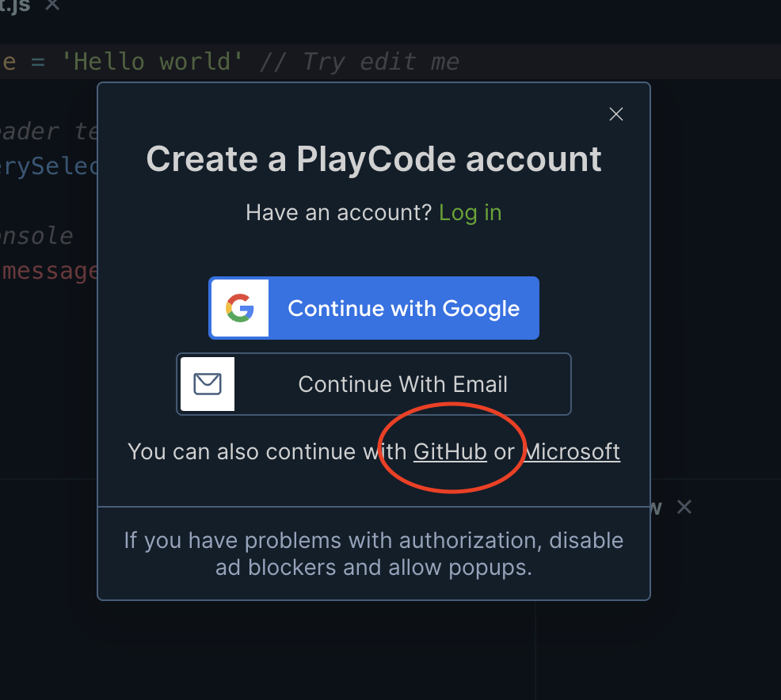

## Week One Overview
Ryan and I set up his work environment for development. We learned about the importance of using hotkeys, how to control our system via commands and began to learn about HTML, React, and CSS.

## Review
### Hotkeys

Code Control
  * `⌘` + `Z` - Undo
  * `⌘` + `A` - Select All
  * `⌘` + `C` - Copy Selection
  * `⌘` + `X` - Cut Selection
  * `⌘` + `V` - Paste Selection
  * `⌘` + `S` - Save
  
Application Control
  * `⌘` + `T` - Open New Tab
  * `⌘` + `R` - Refresh
  * `⌘` + `W` - Close Window
  * `⌘` + `Q` - Close Program
  
Computer Control
  * `⌘` + `Space` - Open Spotlight
  * `⌘` + `Tab` - Change Program
  * `⌘` + `` ` `` - Change Window Within Program
  
Terminal Control
  * `Ctrl` + `C` - Stop Program
  * `↑` - Print previous command


### Terminal Commands
* `pwd` - Print Working Directory
* `ls` - List all files within director
* `cd` - Change directory
    * `cd ..` -  Change directory Up

### Applications
* `npm` - Node Package Manager
   *  Used to run scripts.
   *  `npm start`- Starts our program
   *  `npm install` - Installs our program and it's dependencies
*  `brew` - Homebrew
   *  Used to install terminal packages
*  `git` - Version Control System
   * `git add .`  - Stages all modified files to be committed
   * `git commmit -m "Commit Message"` - Commits code
   * `git push` - Pushes Commits to origin (Github)


## Homework
### Git
  We use Git to share our code and work together. We could save the code on our own computer, but working with a team or actually deploying our code online will be much more difficult. Read [this Github CLI documentation](https://github.com/cli/cli?tab=readme-ov-file#installation) and use the skills you learned in our first lesson to install the Github CLI. If you are up for the challenge, attempt to use the CLI to log into Github!

  When we are working, we will be using Git Flow. Watch [this video](https://www.youtube.com/watch?v=USjZcfj8yxE) and [read this](./git_flow.pdf) to begin to learn about Git Flow. Before our next lesson, you will **not** have to do anything with Git or Github. Just begin to learn.

###  Setup Playcode
  * Navigate to [Playcode](https://playcode.io/javascript)
  * Register for an account, and use your Github to log in.
   
  * Share your workspace and Slack me the link.

> Within `style.css`, do the following
> * Remove all the auto generated code
> * Insert the following code
```css
body {
  background-color: blue;
  height: 100vh;
  width: 100vw;
}

h1 {
  color: orange;
}

ol li {
  color: greenyellow;
  font-style: italic;
}
```

### Javascript and Typescript
  We will be doing a lot of work in Typescript. Typescript is a **superset** of Javascript.
  This means that everything that we can do in Javascript, we can also do in Typescript. First, lets learn a bit about Javscript, and soon you will learn why we are working in Typescript. Begin by [watching this course](https://www.youtube.com/watch?v=le-URjBhevE&list=PLWKjhJtqVAbk2qRZtWSzCIN38JC_NdhW5&pp=iAQB).


> Within `index.js`, write code that does the following:
> * Remove all auto generated code.
> * Define variable named `family` that is an array with one element that is a `string` of your first name and last name.
> * `push` to that array all of your siblings names.
> * Write a function named `checkFamily` that receives that array as a **parameter**.
> * Within that function, check to ensure that `every` element is not equal, remember `!==`, to  `Easter Bunny`.
> * That function should return a `true` if `Easter Bunny` is in `family` and `false` it is not.
> * Define a `const`ant named `validFamily` that is the result of `checkFamily`.
> `console.log` the value of `validFamily`.

```javascript
const family = ['Ryan Ruiz']
family.push('Kylee Ruiz')
family.push('Sienna Ruiz')

function checkFamily(familyMembers) {
  return familyMembers.every((familyMember) => familyMember !== 'Easter Bunny')
}

const validFamily = checkFamily(family)
console.log(validFamily)
```

  
### HTML
  HTML is the language that web browsers understand to know what is visible on the screen. [Watch basic HTML](https://www.youtube.com/watch?v=salY_Sm6mv4) and [this documentation](./html.pdf).

> Within `index.html`, write code that does the following:
> * Remove the `script` auto generataed script tag
> * Modify the **content** of the level 1 heading tag, `h1`, to be `Ryan Ruiz codes`
> * Create a level 2 heading tag, `h2`, tag with the content of `Learning to Code`
> * Create a paragraph tag, `p`, with why you are excited to learn how to code.
> * Create a level 2 heading tag, `h2`, with the content of `Favorite Games`
> * Create an ordered list tag, `ol`.
> * within that ordered list, create list items, `li`, for each of your favorite games.
>   * This is an ordered list, so make sure the games or in order of favorites!
>   * Make sure your `ol` tag completely surrounds the list items.

### React
  We spoke about learning a bit of React but we don't want to get too far ahead of ourselves.

  You can read ahead the following, but it is not required before next week:
  * [React Overview](https://react.dev/learn/tutorial-tic-tac-toe#overview)
  * [React Components](https://react.dev/learn/your-first-component)
  * [JSX](https://react.dev/learn/writing-markup-with-jsx)